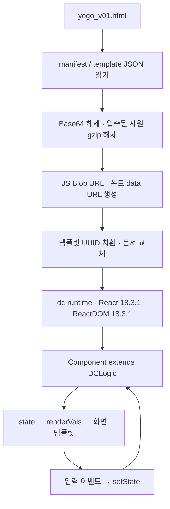

# 요고비 프론트 코드 분석

> 이 문서는 재편성 전 HTML 프로토타입의 분석 기록입니다. 현재 구조·API 연결 상태는 [연동 명세](integration.md)와 [실행 안내](../README.md)를 확인하세요. 아래 코드 재현 예시는 원본 커밋의 HTML에만 적용됩니다.

분석일: 2026-09-11

현재 프론트는 **통신비·구독료를 입력하고 A/B/C 추천 조합을 비교하는 단일 HTML 프로토타입**이다. 입력과 화면 전환은 구현되어 있지만, 추천 금액은 브라우저의 고정 규칙으로 계산한다. 백엔드 추천 API, 로그인, 실제 파일 업로드, 결과 저장은 연결되어 있지 않다.

## 1. 분석 대상과 범위

| 항목 | 확인한 내용 |
| --- | --- |
| 문서 위치 | 프로젝트 루트의 `docs/README.md` |
| 분석한 코드 | 프로젝트 루트의 [`../yogo_v01.html`](../yogo_v01.html) |
| 원본 커밋 | `ceb809379c75dfd858f1fef2a90676198fac62ad` (`Add yogo html`) |
| 원본 SHA-256 | `93e70995b13eb93a81d1ea1126c6707261b1f44a13f50d261271ce9890c1f18c` |
| 파일 크기 | 4,356,664 bytes, 약 4.15 MiB |
| 분석 방법 | HTML 내부 JSON·리소스 복원, 정적 코드 분석, 추출한 로직의 Node 실행 |

최초 분석 시 HTML은 `front/Front`, 문서는 `front/yogob_front/docs`에 나뉘어 있었다. 디렉터리 정리 후 같은 프로젝트 루트 아래에 HTML과 문서를 모았다. HTML 내용은 변경하지 않았다. 브라우저 화면, 실제 서버 연동, 외부 사업자의 최신 가격은 검증 범위에 포함하지 않았다. 아래 가격은 모두 **코드에 들어 있는 값**이다.

## 2. 파일과 실행 구조

분석한 `Front` 저장소의 추적 파일은 `README.md`, `yogo_v01.html`이다. `package.json`, 패키지 잠금 파일, 별도 `src`, 빌드 설정, 테스트 설정은 없다. 따라서 현재 실행 단위는 npm 프로젝트가 아니라 HTML 파일이다.

HTML은 다음 내용을 묶은 배포 산출물 형태다.

| 구성 | 역할 / 원본에서 찾을 위치 |
| --- | --- |
| 바깥쪽 부트스트랩 | 리소스 복원과 문서 교체. 원본 25~367행의 일반 `<script>` |
| `__bundler/manifest` | Base64 리소스 101개: JavaScript 3개, WOFF2 폰트 98개. 원본 369~371행 |
| `__bundler/ext_resources` | React와 ReactDOM의 원래 URL을 내부 리소스 UUID에 연결. 원본 373~375행 |
| `__bundler/page_order` | 빈 배열. 별도 하위 페이지 번들 없음 |
| `__bundler/template` | JSON 문자열로 인코딩된 실제 화면 HTML. 원본 381~383행 |
| `script[data-dc-script]` | 복원된 템플릿 안의 `CATALOG`, `PRIORITIES`, `Component` |



React와 ReactDOM은 UMD production 자원이 HTML에 포함되어 있다. `dc-runtime`은 `<x-dc>`와 템플릿 문법을 해석하고 React로 렌더링한다. 일반적인 JSX 소스나 React Router 구조는 아니다.

- `{{ value }}`: `renderVals()`가 반환한 값 바인딩.
- `<sc-if>` / `<sc-for>`: 조건부 렌더링 / 목록 렌더링.
- `sc-camel-on-click`, `sc-camel-on-change`: 이벤트 핸들러 바인딩.
- `<sc-raw-select>`: 런타임이 처리하는 select 표기.
- `DCLogic.setState()`: React 래퍼를 통해 로직 상태와 화면을 갱신.
- `evalDcLogic()`: `new Function`으로 내부 `Component` 코드를 평가.

### 로컬에서 보기

프로젝트 루트에서:

```sh
python3 -m http.server 8000 --bind 127.0.0.1
```

브라우저에서 `http://127.0.0.1:8000/yogo_v01.html`을 연다. 이 명령은 실행 안내이며, 이번 분석에서 브라우저 렌더링을 검증하지는 않았다. 압축 자원 복원에 `DecompressionStream('gzip')`을 사용한다. 배포 환경을 바꾸면 Blob 스크립트, data 폰트, 동적 코드 평가가 해당 환경의 CSP에서 허용되는지 확인해야 한다.

## 3. 화면과 이동 흐름

URL 경로를 바꾸는 라우팅 없이 `state.step`으로 화면을 선택한다.

| step | 화면 | 주요 동작 |
| --- | --- | --- |
| 1 | 통신 현황 | 통신사, 월 통신비, 요금제명, 데이터 구간, 약정 유형·종료일, 결합 상품 입력 |
| 2 | 구독 현황 | 카탈로그에서 구독 추가, 등급·금액 변경, 삭제, 캡처 업로드 모양의 버튼 |
| 3 | 우선순위·예산 | 통신·구독별 `필수 / 대체가능 / 불필요`, 월 예산 설정 |
| 4 | 계산 중 | 스피너 표시, 1,900ms 타이머 후 결과 화면으로 이동 |
| 5 | 추천 결과 | A/B/C 카드, 월·연 절감액, 변경 항목, 실행 안내·주의 문구 표시 |

상단에는 로그인 버튼과 정보 이용 고지가 있다. 입력 단계에는 왼쪽 단계 이동과 오른쪽 지출 요약이 보이고, 결과 화면에서는 두 영역이 숨겨진다. `showNotice` prop의 기본값은 `true`다.

`next()`는 1단계에서 필수값을, 3단계에서 구독 금액을 검사한다. 왼쪽 단계 버튼은 `go(n)`을 직접 호출하므로 앞 단계 검증을 거치지 않고 이동할 수 있다. `restart()`는 `go(1)`만 호출해 입력값을 유지한다. 1단계의 “처음으로”도 단계 1에 머무른다.

## 4. 상태와 데이터 흐름

별도 전역 상태 저장소나 API 계층 없이 하나의 `Component`가 입력, 추천 계산, 화면용 값과 이벤트를 소유한다.

| 상태 | 초기값 | 실제 사용 |
| --- | --- | --- |
| `step`, `showErr` | `1`, `false` | 화면과 검증 오류 표시 |
| `carrier`, `planName` | 빈 문자열 | 현재 요금제 및 추천 카드 이름 |
| `fee` | 빈 문자열 | 현재 통신비, 추천 계산·절감액 기준 |
| `data` | 빈 문자열 | A/B 추천 가격 배열의 인덱스 |
| `ctype`, `cend` | 빈 문자열 | 유형은 필수 검증·요약 표시, 종료일은 입력 상태만 보관 |
| `bundles` | `[]` | 결합 선택 버튼 표시 |
| `subs` | `[]` | 구독 목록과 요금·우선순위, 추천 계산 |
| `budget` | `70000` | 예산·차이 안내 표시. 추천 후보 제한에는 사용하지 않음 |
| `shot` | `false` | 캡처 버튼의 표시 문자열 전환 |
| `planPriority` | `대체가능` | 통신 우선순위 선택 표시. 계산에는 사용하지 않음 |
| `selCombo` | `A` | 상세 내용을 보여줄 추천 카드 |

구독 항목은 `id`, `name`, `category`, `color`, `tiers`, `tier`, `price`, `priority`를 가진다. 추가 시 첫 번째 등급과 가격을 쓰고 우선순위는 `대체가능`이다. 등급 변경 시 가격도 바뀌며 직접 금액을 수정할 수도 있다. 이미 선택한 구독은 추가 목록에서 제외된다.

현재 지출은 `num(fee) + subs의 num(price) 합계`다. `renderVals()`는 이 값으로 요약·문구·카드 스타일·이벤트를 만들어 템플릿에 전달하고, 결과 단계에서 `combos()`를 호출한다.

`localStorage`, `sessionStorage`, IndexedDB에 사용자 입력을 저장하는 구현은 없다. 입력은 실행 중인 컴포넌트 상태에 있으며 새로고침 시 복원되지 않는다. 화면의 “최대 24시간 보관 후 자동 삭제”에 해당하는 보관·만료 처리도 없다.

## 5. 구독 카탈로그

`CATALOG`는 아래 8개 서비스를 직접 선언한다. 가격 조회 API나 가격 출처·유효기간 데이터는 없다.

| 서비스 | 코드에 선언된 등급과 월 금액 |
| --- | --- |
| 넷플릭스 | 광고형 스탠다드 5,500 / 스탠다드 13,500 / 프리미엄 17,000원 |
| 유튜브 프리미엄 | 개인 14,900 / 가족 30,900 / 학생 8,690원 |
| 티빙 | 광고형 5,500 / 베이직 9,500 / 스탠다드 13,500원 |
| 웨이브 | 베이직 7,900 / 스탠다드 10,900 / 프리미엄 13,900원 |
| 쿠팡플레이 | 와우 멤버십 7,890원 |
| 디즈니+ | 스탠다드 9,900 / 프리미엄 13,900원 |
| 스포티파이 | 개인 11,990 / 듀오 16,350원 |
| 밀리의 서재 | 구독 9,900원 |

## 6. 추천 계산의 실제 규칙

`combos()`는 항상 A/B/C 세 조합을 만든다. 실재 상품 조회, 예산 기준 필터링, 약정 위약금 계산, 변경 시점 최적화는 수행하지 않는다.

데이터 구간 순서는 `3GB 미만 / 3~10GB / 10~50GB / 50GB 이상 / 무제한`이다. 데이터 미입력 시 세 번째 구간, 통신비가 숫자로 0이면 55,000원을 사용한다.

| 조합 | 통신비 규칙 | 구독 처리 |
| --- | --- | --- |
| A 최대 절감형 | 구간별 `[8800, 13200, 24200, 29700, 33000]`과 현재 통신비 중 작은 값 | `불필요`와 `대체가능` 해지, `필수` 유지 |
| B 균형형 | 구간별 `[19000, 26000, 35000, 42000, 52000]`과 현재 통신비 중 작은 값 | `불필요` 해지, `대체가능`은 카탈로그 최저 등급이 현재 가격보다 쌀 때 낮춤 |
| C 혜택 유지형 | `Math.round(fee * 0.88 / 100) * 100`과 현재 통신비 중 작은 값 | `불필요` 해지 후, 남은 첫 OTT 항목을 제휴 포함으로 처리해 비용 0원, 나머지 유지 |

조합 총액은 추천 통신비와 남은 구독 비용의 합이다. 월 절감액은 현재 총액에서 조합 총액을 뺀 값, 연 절감액은 월 절감액 × 12다. 카드 순서는 A/B/C로 고정이며 실제 총액으로 정렬하지 않는다. “가장 싸요” 같은 배지도 고정 문자열이다.

예를 들어 KT, 통신비 55,000원, 데이터 `10~50GB`, 넷플릭스 광고형 5,500원(`대체가능`)이면:

| 항목 | 현재 | A | B | C |
| --- | ---: | ---: | ---: | ---: |
| 통신비 | 55,000 | 24,200 | 35,000 | 48,400 |
| 구독비 | 5,500 | 0 | 5,500 | 0 |
| 월 총액 | 60,500 | 24,200 | 40,500 | 48,400 |
| 월 절감액 | — | 36,300 | 20,000 | 12,100 |

이는 현재 코드의 재현 결과이며 실제 가입 가능한 요금이나 제휴를 입증하지 않는다.

## 7. 구현 상태와 확인된 차이

| 항목 | 확인 결과 |
| --- | --- |
| 입력·구독 편집·카드 선택 | 이벤트와 상태 변경 구현 있음 |
| 필수값 검사 | 1단계 `다음`에서 통신사·1,000원 이상 통신비·데이터·약정 유형 검사. 3단계에서 구독 가격이 0인지 검사 |
| 추천 API / 챗봇 | 업무 API 호출과 채팅 UI 없음. 런타임의 리소스 로딩용 `fetch`는 존재 |
| 계산 중 표시 | 서버 요청을 기다리는 대신 1.9초 타이머로 전환 |
| 캡처 업로드·자동 가림 | 파일 입력·전송·OCR·마스킹 없음. `shot`만 토글하고 고정 파일명과 완료 문구 표시 |
| 로그인 | 버튼만 있고 이벤트 없음 |
| 조합 저장 / 비교표 내려받기 | 버튼만 있고 이벤트 없음 |
| 정보 수집 안내 링크 | `href="#privacy"`만 있고 대응하는 `id="privacy"` 없음 |

후속 구현 시 우선 확인할 동작은 다음과 같다.

1. **입력 조건과 결과 불일치:** `budget`, `planPriority`, `ctype`, `cend`, `bundles`를 바꿔도 동일한 계산 입력의 추천은 그대로다. “필수는 그대로”, “위약금 반영”, “예산 기준” 문구가 실제 로직보다 넓은 기능을 약속한다.
2. **검증 우회:** 빈 상태에서 왼쪽 3단계로 이동 후 추천을 요청하면 결과가 생성된다. 최종 추천 요청에서도 전체 입력을 검증해야 한다.
3. **제휴·가격 가정:** C의 12% 할인과 첫 OTT 무료 처리는 가입 자격·실제 제휴 확인이 없다. B는 학생 등급을 포함해 최저 가격만 고르며 자격을 확인하지 않는다. A/B 가격은 현재 통신비로 상한을 씌워 해당 이름의 실제 요금과 달라질 수 있다.
4. **숫자 파싱:** `num()`은 숫자가 아닌 문자를 모두 제거한다. `-55000`은 `55000`, `12.5`는 `125`가 된다. 금액의 음수·소수·허용 범위를 명시적으로 검증하지 않는다.
5. **결합 선택 모순:** `없음`도 다른 결합과 동일하게 토글되어 `인터넷`과 동시에 선택할 수 있다.
6. **접근성·화면 검증:** 포커스 outline과 삭제 버튼의 접근성 이름은 있으나, 입력 label 연결, 선택 버튼의 `aria-pressed`, 오류 안내 연결은 템플릿에서 확인되지 않는다. 레이아웃은 flex-wrap·auto-fit을 사용하지만 모바일 실제 화면과 키보드 이용은 별도 검증이 필요하다.

## 8. 백엔드 연결 시 경계

상위 작업 루트의 `AGENTS.md`에는 **금액 계산은 `BE_main`의 `pricing` 모듈이 전담**, **금액마다 출처(Provenance) 제공**, **미사용 혜택은 0원**, **필터와 챗봇은 같은 엔드포인트 사용** 원칙이 있다. 현재 HTML의 계산은 프로토타입 규칙으로 구분해야 한다.

백엔드 연결 시에는 실제 계약을 확인한 뒤 입력을 전달하고, 서버가 계산한 조합·총액·절감액·출처를 표시하는 구조로 바꾸는 것이 필요하다. `combos()`를 운영용 계산 엔진으로 확장하지 않는다. API 경로와 요청·응답 스키마는 이 분석에서 확인하지 않았으므로 문서에 가정하여 추가하지 않았다.

## 9. 검증 기록과 재현 방법

내부 앱 JavaScript를 추출해 graphify AST로 함수 관계를 확인했다(19개 노드, 35개 간선). 해당 그래프 진단에서는 누락 endpoint·self-loop·동일 endpoint 간선 축약이 없었다. 템플릿 이벤트는 원본과 직접 대조했다. 분석용 추출물과 그래프는 `/tmp`에 두었으며 이 저장소의 구성 요소가 아니다.

Node의 `assert`로 확인한 항목:

- 빈 입력의 1단계 `next()` 차단 및 `go(3)`을 통한 최종 결과 진입.
- 위 예시의 A/B/C 총액 `24200 / 40500 / 48400`.
- 예산·약정·통신 우선순위·결합 변경이 `combos()` 결과에 영향을 주지 않는 동작.
- 캡처 버튼의 상태 토글, 숫자 파싱 예시, 다시 시작 시 입력 유지.

빌드·기존 테스트 실행은 설정이 없어 수행하지 않았다. 아래는 원본에서 앱 로직을 읽어 주요 계산을 다시 확인하는 최소 명령이다. 프로젝트 루트에서 Node로 실행한다. 원본에 포함된 JavaScript를 실행하므로 위 분석 대상 파일에 사용한다.

```sh
node <<'JS'
const fs = require('node:fs');
const assert = require('node:assert/strict');
const vm = require('node:vm');
const html = fs.readFileSync('yogo_v01.html', 'utf8');
const template = JSON.parse(html.match(/<script type="__bundler\/template">([\s\S]*?)<\/script>/)[1]);
const code = template.match(/<script\b[^>]*data-dc-script[^>]*>([\s\S]*?)<\/script>/)[1];
class DCLogic {
  constructor() { this.props = {}; }
  setState(patch) { Object.assign(this.state, patch); }
}
const ctx = vm.createContext({ DCLogic });
vm.runInContext(code + '\nglobalThis.App = Component; globalThis.catalog = CATALOG;', ctx);
const app = new ctx.App();
app.set({ carrier: 'KT', fee: '55000', data: '10~50GB', ctype: '무약정' });
app.addSub(ctx.catalog[0]);
assert.deepEqual(Array.from(app.combos(), c => c.total), [24200, 40500, 48400]);
const before = JSON.stringify(app.combos());
app.set({ budget: 20000, planPriority: '필수', ctype: '선택약정', cend: '2027-09-11', bundles: ['없음'] });
assert.equal(JSON.stringify(app.combos()), before);
console.log('PASS: 현재 프로토타입 계산 및 미반영 조건 재현');
JS
```

이 검증은 현재 동작을 기록하는 용도다. 백엔드 계산으로 교체하면 고정 가격과 미반영 조건을 기대하는 검증도 함께 변경해야 한다.
